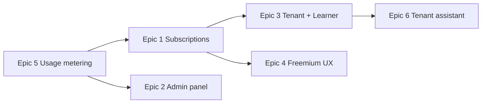

# Talim AI — Product plans

Living roadmap for multi-tenant subscriptions, admin, and tenant/student workflows.  
Add new ideas under [Backlog](#backlog) or extend an epic below.

**AI prompts:** each epic has its own file in [`docs/plans/`](./plans/README.md). Paste `@docs/plans/epic-N-….md` into Cursor — project rules apply automatically.

**Current state (today):** single user type — every registered user is an individual learner who uploads content, generates podcasts/quizzes/summaries, and uses the AI tutor. No roles, tenants, subscriptions, or admin UI. See `apps/api/src/prisma/schema.prisma` and `README.md`.

---

## User types

| Type | Who | Can create content? | Can generate AI? | UI |
|------|-----|----------------------|------------------|-----|
| **Individual learner** | Self-study user | Yes (own materials) | Yes | Current dashboard (mostly as-is) |
| **Tenant** | School, tutor, business, organization | Yes | Yes | Tenant dashboard — manage students + materials |
| **Learner (tenant student)** | Student under a tenant | No | No — consume only | Learner dashboard — assigned materials only |
| **Platform admin** | You (operator) | N/A | N/A | Admin panel — full platform control |

**Rule:** Tenants and their learners share one organization. Generation (upload, podcast, quiz, slideshow, tutor for content creation) is tenant-side. Learners only read, watch, listen, take tests, and chat within assigned scope.

---

## Architecture direction (shared)

Before building UI, extend the data model and auth:

- `UserRole`: `INDIVIDUAL`, `TENANT_OWNER`, `TENANT_LEARNER`, `ADMIN`
- `Tenant` (organization): name, slug, owner, settings, subscription link
- `TenantMembership`: user ↔ tenant, role within tenant
- `Content` ownership: `userId` (individual) **or** `tenantId` (tenant-owned, assignable to learners)
- `Subscription` + `Plan` + usage metering (see Epic 1 & 5)
- `ApiUsageEvent` for cost tracking (Epic 2)

Suggested implementation order: **roles & tenancy → billing limits → tenant UI → learner UI → admin panel → analytics**.

---

## Epic 1 — Subscriptions & billing

Monthly subscription. Individual learners can use a **freemium** tier; tenants **must** subscribe. Tenant price scales with **student count** and **uploaded materials** (tiered or formula-based).

### Requirements

- Plans: `FREE` (individual only), `INDIVIDUAL_PRO`, `TENANT_STARTER`, `TENANT_GROWTH`, … (exact tiers TBD)
- Stripe (or similar) checkout + webhooks for `active`, `past_due`, `canceled`
- Enforce limits server-side (not just UI): max uploads, max generations/month, max students, max storage
- Tenant pricing inputs: `# active learners`, `# content items`, optional overage
- Grace period + read-only mode when subscription lapses
- Expose `GET /api/billing/me` and tenant billing summary

### Freemium limits (starting point — tune later)

| Feature | Free (individual) | Paid individual | Tenant (paid) |
|---------|-------------------|-----------------|---------------|
| Uploads | 3 materials | Unlimited | By plan + overage |
| AI generations / month | Low cap | Higher cap | Per-seat + material tier |
| Podcast / quiz / slideshow | Limited | Full | Full for tenant; learners consume |
| AI tutor | Limited messages | Full | Learners: scoped to assigned content |
| Students | — | — | Plan-based seat count |

### AI prompt

→ [`docs/plans/epic-1-subscriptions-billing.md`](./plans/epic-1-subscriptions-billing.md)

---

## Epic 2 — Platform admin panel

Admin UI for you to manage the whole platform: all individual users, all tenants, subscriptions, content, generated assets, and **API cost per user**.

### Requirements

- Separate app: `apps/admin` on `admin.talim-ai.uz`, protected by `ADMIN` role (login only; admins created via CLI)
- User CRUD: create, update, delete, reset password, change role, impersonation optional later
- Tenant CRUD: view org, owner, members, subscription, suspend tenant
- Content CRUD: list/delete any user's or tenant's uploads, re-trigger failed jobs
- Generated assets CRUD: podcasts, quizzes, slideshows (`ContentVideo`), summaries — view metadata, delete, download paths
- **Cost dashboard:** aggregate `ApiUsageEvent` by user/tenant/day (tokens, model, estimated USD)
- **Statistics:** signups, active users, content ingested, generations, revenue (from Stripe), top tenants by usage
- Audit log for admin actions (who deleted what)

### AI prompt

→ [`docs/plans/epic-2-admin-panel.md`](./plans/epic-2-admin-panel.md)

---

## Epic 3 — Tenant (organization) experience

Paid tutor / school / business manages materials and student accounts. Students only consume. Tenant sees each student's learning track.

### Requirements

- Tenant onboarding: register as tenant OR upgrade individual → tenant (creates `Tenant` + `TENANT_OWNER`)
- Tenant dashboard (different nav from individual learner):
  - Materials library (upload PDF/YouTube/slides — same pipeline as today)
  - Generate podcast, quiz, slideshow, summaries for their content
  - **Students:** invite/create accounts (`TENANT_LEARNER`), assign/unassign content
  - **Progress:** per-student view — `ContentProgress`, `SectionProgress`, `QuizAttempt`, `LearningActivityDay`, podcast progress
  - **AI tutor:** assistant for tenant (help prepare materials), not a replacement for tenant authorship
- Learners log in → see only **assigned** content; no upload, no generate buttons
- Tenant can deactivate learner, reset progress optional
- Bulk invite (CSV email list) — later phase

### Data model notes

- `Content.tenantId` nullable; if set, `userId` is creator (tenant owner/staff)
- `ContentAssignment`: contentId, learnerId, assignedAt, assignedBy
- Learner API filters: all content queries scoped to assignments + tenant membership
- Reuse existing progress models; they already key on `userId`

### AI prompt

→ [`docs/plans/epic-3-tenant-experience.md`](./plans/epic-3-tenant-experience.md)

---

## Epic 4 — Individual learner (current product)

Mostly what exists today. After Epic 1, wrap with freemium limits and optional `INDIVIDUAL_PRO` upgrade.

### Already implemented

- Auth, dashboard, content upload (PDF, YouTube, slides)
- Sections, summaries, podcasts, quizzes, AI tutor chat
- Progress tracking (`ContentProgress`, `SectionProgress`, `LearningActivityDay`)

### Remaining work (when billing lands)

- Usage meters in UI
- Upgrade prompts when hitting free limits
- Billing settings page

### AI prompt

→ [`docs/plans/epic-4-individual-freemium.md`](./plans/epic-4-individual-freemium.md)

---

## Epic 5 — Usage metering & platform cost

Foundation for admin cost dashboard and fair billing.

### Requirements

- Record every paid API call: embeddings, chat completion, TTS, transcription, quiz/podcast/section generation
- Store: userId, tenantId (if any), feature enum, model, tokens, estimated cost
- Monthly rollups for billing enforcement and admin reports
- Optional: daily job to sync Stripe metered usage for tenant overages

### AI prompt

→ [`docs/plans/epic-5-usage-metering.md`](./plans/epic-5-usage-metering.md)

---

## Epic 6 — Tenant AI assistant (tutor helper)

AI tutor as **assistant to the tenant**, not the primary teacher. Helps tenants draft quizzes, summarize uploads, suggest section splits — separate from student-facing tutor.

### AI prompt

→ [`docs/plans/epic-6-tenant-assistant.md`](./plans/epic-6-tenant-assistant.md)

---

## Backlog

_Add new ideas here. Copy the template._

### Template

```markdown
### [Short title]

**Status:** idea | planned | in progress | done  
**Epic:** 1–6 or new  
**Notes:** …

**AI prompt file:** `docs/plans/backlog/<slug>.md` (copy template from any epic prompt file)
```

---

## Suggested build order



1. **Usage metering** — needed for admin costs and quota enforcement  
2. **Subscriptions** — plans, Stripe, limits  
3. **Tenant + learner** — core B2B value  
4. **Admin panel** — operate the business  
5. **Freemium polish** — individual tier UX  
6. **Tenant assistant** — nice-to-have differentiator  

---

## How to use this doc

1. Paste `@docs/plans/epic-N-….md` into Cursor (or copy the prompt block from that file).
2. Rules apply automatically — see `.cursor/rules/docs-plans.mdc`.
3. When an epic ships, mark requirements done here and note the PR/commit.
4. New ideas → [Backlog](#backlog) + `docs/plans/backlog/<slug>.md`.
5. Open questions (payment provider, exact tier prices, Uzbekistan payment methods) — decide before Epic 1.

---

## Open decisions

| Question | Options | Decide before |
|----------|---------|---------------|
| Payment provider | Stripe, Payme, Click, hybrid | Epic 1 |
| Tenant student auth | Email/password invite, magic link, SSO later | Epic 3 |
| Content isolation | Strict tenant DB scoping vs shared pool | Epic 3 |
| Slideshow product name | `ContentVideo` in schema vs user-facing "slideshow" | Epic 3 UI |
| Admin URL | `apps/admin` on `admin.talim-ai.uz` | Done (Epic 2) |

---

## QA-deferred structural items (from overnight visual-QA, Run 18 — 2026-07-12)

Structural findings that need a product decision, a schema migration, or a hot-path/auth change — not
safe to auto-fix in an unattended QA run. Each has an evidence bundle in `docs/qa/user-stories.md`
(findings ledger) + `docs/qa/visual-qa-report.md` (Run 18).

| Item | What | Why deferred | Owner | Logged |
|------|------|--------------|-------|--------|
| F78 | FLAGGED generated media (podcast/quiz/slideshow/summary) is label-only — never hidden from learners; no serving-path consumer of `GeneratedMediaReview.status`. | Needs a product decision on hide semantics ("under review" placeholder vs full hide) + serving-path enforcement. | @KAMRONBEK | 2026-07-12 |
| F77 | Assessment re-assign is a silent no-op on already-assigned learners (`if (existing) continue`); a due-date / content-scope change is dropped and there is no unassign route. | Needs upsert-semantics decision (update dueAt/content? reset attempts?) + an unassign endpoint. | @KAMRONBEK | 2026-07-12 |
| F39 | GAME leaderboard speed-points use client-supplied `responseMs` (clamped to [0,limit], negatives rejected — so no *impossible* scores, but a cheater who knows answers can forge `responseMs=0` for the max speed factor). | True server-authoritative timing needs a per-attempt/per-question served-timestamp (stateful) — schema + hot scoring-path change. | @KAMRONBEK | 2026-07-12 |
| O81 | Impersonation token is not single-use (stateless 30-min JWT, replayable within its window). | Server-side jti/nonce tracking = structural; stateless was a deliberate tradeoff. | @KAMRONBEK | 2026-07-12 |
| F59/F69/F62/F75 | (prior runs) persisted `Quiz.status`; web `error.tsx` boundary; API error-code contract; web `text-destructive` token split. | Migrations / app-wide render behaviour / design calls. | @KAMRONBEK | 2026-06-29 |
